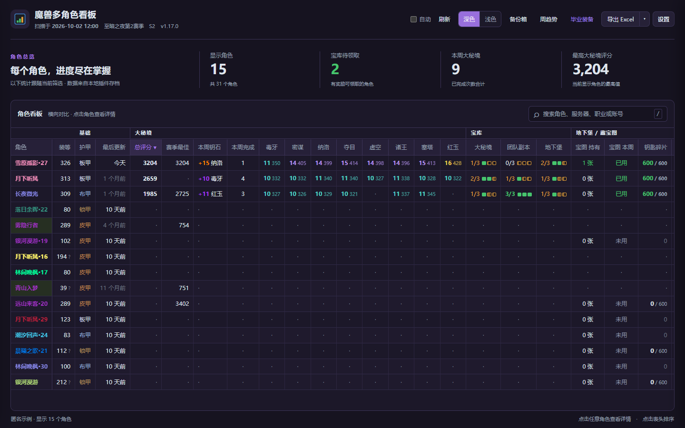
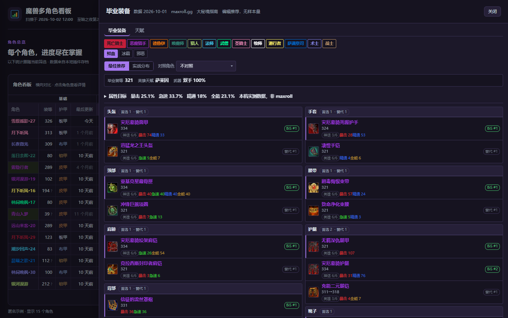

# 魔兽多角色看板（WowAltBoard）

[](LICENSE)
[](https://ifdian.net/a/lianzy)

把游戏里插件存下来的数据汇总成一个本地网页：**所有战网账号、所有角色**的大秘境、宝库、
地下堡、藏宝图、团本、纹章、猎物、装备、金币、专业，一张表里横向对比。截图为匿名示例数据。



## 下载安装

**[去 Releases 下载最新版 ZIP](https://github.com/Lianzy-Baimiao/WowAltBoard/releases/latest)**

下载附件里的 `WowAltBoard-vX.Y.Z.zip`（**不是**「Source code」那个压缩包），
解压到一个**可写**的目录，双击 `魔兽看板.exe`，完事。

Windows 10/11 使用系统 PowerShell 和 .NET。新版优先使用 WebView2 原生窗口；若未安装 WebView2 Runtime，会自动回退到 Chrome / Edge 应用窗口。
想要桌面图标的话，托盘菜单里有「创建桌面快捷方式」。

## 快速开始

1. 安装并启用 [AlterEgo](https://www.curseforge.com/wow/addons/alterego) 插件（数据来源，必装）
2. 登录每个想看的角色，`/reload` 或退出游戏让插件写盘
3. 双击 `魔兽看板.exe`：它扫描游戏目录、打开看板窗口，然后常驻托盘，
   游戏写盘后自动重扫
4. 想要**专业**列就再装 [BagSync](https://www.curseforge.com/wow/addons/bagsync)；
   **备份箱**需要 MySlot 或编辑模式缓存。两个都是可选的，没装只是少几列

托盘右键菜单：打开看板 / 立即重新扫描 / **设置游戏目录** / 创建桌面快捷方式 / 退出。
默认只读正式服；要连经典怀旧服一起读，改 `tools/config.json` 的 `includeFlavors`。

## 主要功能

* **一张表对比所有角色**：多账号、跨服务器，60+ 列按需显示，点表头排序，
  按住表头拖动换列位置，整组也能搬家；调好的视图可以存成命名「布局方案」一键切换
* **角色详情**：点任意一行看逐本最佳记录、宝库三档、装备 16 槽位、狩猎清单
* **周趋势**：按游戏周对比评分、装等、宝库、藏宝图的变化
* **毕业装备 / 天赋**（顶栏「毕业装备」）：全部 40 个专精的毕业装推荐、
  和自己角色的对照、属性目标，以及排行榜热门天赋串——数据都在包里，离线可用
* **导出**：Excel / CSV / 打印成 PDF，导出的就是当前屏幕上的列和行
* **本地运行**：整个文件夹拷到 U 盘、别的电脑都能用；页面本身不联网



天赋面板里点「复制」拿到官方导入串，到游戏里按 `N` → 右下角「导入/导出」→「导入」粘贴即可。

## 常见问题

**找不到游戏目录**　托盘菜单 →「设置游戏目录」选一下；或编辑 `tools/config.json`
的 `wowPaths`（反斜杠要写两个）。

**扫不出数据**　看板会弹对话框说明具体原因（没装插件 / 装了没启用 / 从没登录过）。
最常见的修法：装好 AlterEgo，登录角色后 `/reload`，回来点「重新扫描」。

**游戏里 RL 后还是旧数据**　看板读取的是插件写入磁盘的存档，不会直接读取游戏内存。
1.17.1 修复了已打开看板不自动更新、文件监听回调线程不正确，以及扫描失败后漏重试的问题。
新版默认每 5 秒检查扫描结果，只在有新结果时刷新；切回看板时也会检查。
请保持启动器运行，游戏中 `/reload` 后通常等待 5～10 秒，轮询兜底时约需 25 秒加扫描耗时。
打开详情/设置面板或正在输入时会暂缓刷新，关闭面板、离开输入框后再等一轮即可。
从 1.17.2 起，**原生桌面窗口的「刷新」按钮包含手动扫描**：点一次即可扫描并在成功后刷新，
扫描中会禁用按钮，失败会保留当前页面并提示原因。即使关闭「自动」，仍可手动扫描。
F5 只重新载入页面，不扫描；普通浏览器窗口也不能直接启动本地扫描，按钮会提示改用
桌面程序或托盘「立即重新扫描」，并提供「仅重新载入已扫描数据」选项。
若手动扫描后仍未更新，检查对应账号的 `SavedVariables/AlterEgo.lua` 修改时间是否在 RL 后变化。
旧版 1.17.0 可先用上述手动重扫 + 刷新临时解决，不必先退出游戏。

**杀毒软件把 exe 隔离了**　exe 是发布时现场编译的，个别杀软会误报。
用 `启动.bat` 代替，功能一样（会开一个控制台窗口）。

**想读经典怀旧服**　`tools/config.json` 里把 `includeFlavors` 改成 `[]`（全读）
或列出想要的版本。

**毕业装备 / 天赋的数据怎么更新**　它们是打进包里的静态参照表，不会自己更新。
两种方式：①面板里「数据过期了？更新这些数据 → 在线拉最新数据」——点击才联网，
本次打开立即生效、不写盘，拉不到自动用包里的；②换赛季或想彻底刷新时双击
`更新数据.bat`（要联网；最慢的实战分布一步限速跑约 47 分钟，不想要它就用
命令行 `-SkipRio` 跳过），面板里也带可复制的完整命令。团本天赋串那一步需要
在 [Warcraft Logs](https://www.warcraftlogs.com/api/clients/) 免费申请一个
API 凭证（面板里的悬停说明有具体步骤），没有会跳过这一步。

## 数据与隐私

* 所有数据都从本机的插件存档（`WTF/Account/.../SavedVariables`）读取，
  解析结果写进看板文件夹的 `data/`——那是你的角色名、服务器、公会、金币、
  账号文件夹名和绝对路径，**不要把 `data/` 上传或分享给别人**
* 页面完全本地运行；唯一联网的是启动器问 GitHub「有没有新版本」（可在
  config 里把 `checkForUpdates` 设为 `false` 关掉）
* 备份串（MySlot 等）只在本地保存，不会发出任何地方

## 已知限制

* 只能看到**装了 AlterEgo 且登录过**的角色
* 专业列依赖 BagSync，没装就没有
* 主表货币没有图标（存档只给游戏内部 ID）；毕业装备面板的图标是打包好的
* 狩猎首领名是英文（游戏没把中文名写进存档）
* 天赋树是只读的展示，不是模拟器；改天赋用面板给的导入串

## 开发

```
node tools\run-tests.js        # 离线测试套件；或开 tests.html
tools\build-launcher.ps1       # 编译启动器 exe
tools\build-release.ps1        # 打发布 ZIP
```

仓库不包含 `data/`（个人数据，已 gitignore）和 exe（Release 附件分发）。
换赛季更新参照数据的抓取脚本在 `tools/` 里（`gen-bis.js`、`gen-talents.js`、
`fetch-*.js`，需要联网）。

作者：白描（[GitHub](https://github.com/Lianzy-Baimiao)）　许可：MIT

## 赞赏

工具免费，没有广告也没有内购。如果它帮你省下了每周翻小号的时间，欢迎请我喝一杯：
**<https://ifdian.net/a/lianzy>**　（看板里也有入口：设置 → 赞赏）

## 桌面窗口与发布包

新版启动器优先使用 **WebView2 原生桌面窗口**，不再把浏览器应用窗口作为唯一外壳。

- Windows 11：标题栏、边框和标题文字跟随看板的深浅主题与皮肤，保留系统拖动、缩放、贴靠、最小化和最大化。
- Windows 10：使用系统原生窗口，支持的系统版本会同步标题栏明暗；具体标题栏颜色取决于系统能力，不保证和 Windows 11 完全一致。
- 未安装 WebView2 Evergreen Runtime，或桌面组件不完整时，启动器回退到原先的 Chrome / Edge 应用窗口。不会静默安装运行时。
- 外部网页链接交给默认浏览器打开，不在看板窗口内浏览外站。
- 桌面窗口自己的浏览器缓存保存在 `data/webview2/`，上次窗口颜色保存在 `data/desktop-theme.json`。它们属于个人数据，不进入发布 ZIP。

**首次切换请注意**：原生窗口与普通浏览器不共享 localStorage。要带过浏览器中尚未落盘的布局，先在旧看板「设置」中保存设置到文件，让启动器扫描吸收到 `data/settings.js` 后再切换；不需要的缓存可以在完全退出程序后清理。

发布仍采用绿色 ZIP，不强制引入安装器。解压后的主入口仍是 `魔兽看板.exe`，原生窗口及少量依赖放在 `tools/desktop/`，不要单独移动里面的 EXE。

构建时：

```powershell
# 同时编译启动器和原生窗口。首次构建会从 NuGet 下载固定版本的 WebView2 SDK。
.\tools\build-launcher.ps1

# 构建独立预览包，不覆盖同版本的正式 ZIP。
.\tools\build-release.ps1 -Suffix desktop-preview
```

SDK 固定为 `Microsoft.Web.WebView2 1.0.2903.40`，构建缓存位于 `%LOCALAPPDATA%\WowAltBoard-build\`；发布包只包含托管桥接 DLL、对应架构的加载器和许可文件，不捆绑整个浏览器。用户运行不需要 NuGet、Node.js 或开发 SDK。ARM64 设备可通过系统的 x64/x86 兼容能力运行，尚未在 ARM64 实机验证。
